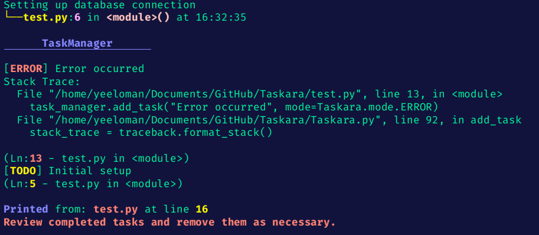

# GhostInk

**GhostInk** is a lightweight task management tool designed for backend developers. It allows users to efficiently manage and track tasks in their code, providing detailed information about the context of each task, such as the file, line number, and function where the task was logged. GhostInk facilitates debugging and improves workflow clarity by categorizing tasks based on different modes like TODO, DEBUG, INFO, and WARN.

## Features

- **Task Management**: Add, filter, and print tasks with various severity levels.
- **Contextual Information**: Each task captures the file name, line number, function name, and a timestamp.
- **Color-Coded Output**: Tasks are displayed with distinct colors based on their severity, improving readability.
- **Flexible Task Input**: Supports a variety of input types, including strings, dictionaries, lists, and custom objects.
- **Stack Trace Capture**: For DEBUG and WARN tasks, captures and displays stack traces for better context.

## Installation

To use GhostInk, clone this repository to your local machine:

```bash
git clone https://github.com/YOUR_USERNAME/GhostInk.git
cd GhostInk
```

## Usage

### Importing GhostInk

First, import the GhostInk class into your project:

```python
from ghostink import GhostInk
```

### Initializing GhostInk

Create an instance of GhostInk, specifying the project root if necessary:

```python
task_manager = GhostInk(project_root='/path/to/your/project')
```

### Adding Tasks

You can add tasks with different severity modes:

```python
task_manager.add_task("This is a TODO task", mode=GhostInk.mode.TODO)
task_manager.add_task("Debugging the application", mode=GhostInk.mode.DEBUG)
```

### Logging Context

To log a message with contextual information (filename, line number, function name):

```python
task_manager.ln("This is a log message.")
```

### Printing Tasks

To view all tasks, optionally filtered by mode or filename:

```python
task_manager.print(filter_mode=GhostInk.mode.WARN)
```

### Example

Here’s a simple example of how you might use GhostInk in your application:

```python
from ghostink import GhostInk

task_manager = GhostInk()

task_manager.add_task("Initial setup", mode=GhostInk.mode.TODO)
task_manager.ln("Setting up database connection")

# Simulate an error condition
try:
    # some code that raises an exception
    raise Exception("Simulated error")
except Exception:
    task_manager.add_task("Error occurred", mode=GhostInk.mode.ERROR)

# Print all tasks
task_manager.print()
```



## Inspired By

This project is inspired by the [icecream](https://github.com/gruns/icecream) library.

## Contributing

Contributions are welcome! If you have suggestions or improvements, please create a pull request.
